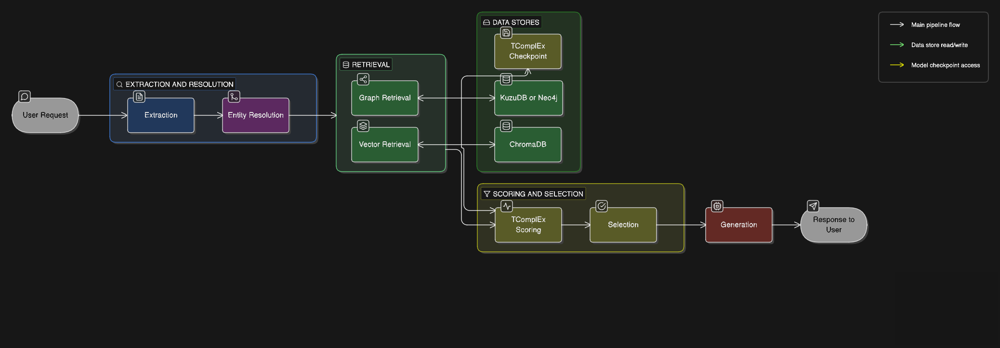

# Personal AI — Knowledge Graph QA Navigator

[](https://www.python.org/downloads/release/python-3100/)
[](LICENSE)
[](https://kuzudb.com/)
[](https://www.trychroma.com/)
[](https://arxiv.org/abs/2005.07782)

Production-система вопросно-ответного поиска поверх графов знаний. Реализует гибридный RAG с темпоральным ранжированием: структурный поиск по графу (KuzuDB / Neo4j / In-Memory) + нейросетевой семантический поиск (ChromaDB + E5) + математическая оценка правдоподобия фактов через TComplEx.

---

## Содержание

- [Быстрый старт с нуля — своими данными](#быстрый-старт-с-нуля--своими-данными)
- [Архитектура](#архитектура)
- [Режимы работы](#режимы-работы)
- [Развёртывание](#развёртывание)
  - [1. Клонирование и окружение](#1-клонирование-и-окружение)
  - [2. E5-модель (обязательно)](#2-e5-модель-обязательно)
  - [3. TComplEx (требуется для темпорального ранжирования)](#3-tcomplex-требуется-для-темпорального-ранжирования)
  - [4. Конфигурация .env](#4-конфигурация-env)
  - [5. Форматы данных](#5-форматы-данных)
  - [6. Первичная сборка KG](#6-первичная-сборка-kg)
  - [7. Запуск бота](#7-запуск-бота)
  - [8. Автозапуск через systemd](#8-автозапуск-через-systemd)
- [Добавление новых фактов в граф знаний](#добавление-новых-фактов-в-граф-знаний)
- [Пакетная загрузка документов](#пакетная-загрузка-документов-ingest_directorypy)
- [TComplEx: переобучение](#tcomplex-переобучение)
- [Интерфейс и интерпретация ответов](#интерфейс-и-интерпретация-ответов)
- [Команды Telegram-бота](#команды-telegram-бота)
- [Структура проекта](#структура-проекта)
- [Ключевые классы](#ключевые-классы)
- [Troubleshooting](#troubleshooting)

---

## Быстрый старт с нуля — своими данными

Полный цикл от пустой машины до работающего бота на ваших документах. Скопируйте блоки команд последовательно, затем читайте пояснения ниже.

> **Требования:** Python 3.10, CUDA GPU (минимум 8 GB VRAM, обязательно для обучения TComplEx), API-ключ LLM (DeepSeek / GigaChat / YandexGPT / OpenAI), токен Telegram-бота от @BotFather.

### Все команды — от клонирования до запуска бота

```bash
git clone https://github.com/SikioN/Personal-AI-dev-2 personal-ai && cd personal-ai
cp .env.example .env
```

```bash
nano .env
```

```bash
cp /path/to/your/documents/* extract/new_docs/
bash setup.sh --build-kg
```

> Для повторной пересборки (если файлы уже обрабатывались) — остановите бота и добавьте `--reprocess`:
> ```bash
> pkill -f "bot.py\|run_db"
> bash setup.sh --build-kg --reprocess
> ```

```bash
bash run_db.sh
```

**1.** Клонирование репозитория и копирование шаблона конфигурации.
**2.** Заполнить `.env`: `TELEGRAM_BOT_TOKEN`, `LLM_BACKEND` + API-ключ, пути к БД и моделям.
**3.** Разместить документы (PDF/DOCX/PPTX/TXT) в `extract/new_docs/`. `setup.sh --build-kg` создаёт окружение, скачивает E5, строит граф из документов и обучает TComplEx.
**4.** Запустить бота в production-режиме (KuzuDB + ChromaDB).

> Подробные инструкции по каждому шагу — см. раздел [Развёртывание](#развёртывание).

## Архитектура

Ядро системы — [`QAEngine`](src/pipelines/qa/qa_engine.py), реализующий 7-стадийный конвейер: Extraction → Entity Resolution → Graph + Vector Retrieval → TComplEx Scoring → Selection → Generation.



---

## Режимы работы

| Режим | Переменные | Граф | Вектор | Когда использовать |
|---|---|---|---|---|
| **SimpleInMemory** | `USE_INMEMORY=true` + движок упал | `raw_quads` список | numpy E5 | Демо без данных, fallback при сбое БД |
| **Full + InMemoryGraph** | `USE_INMEMORY=true` | `InMemoryGraphConnector` | /tmp ChromaDB | Разработка, тесты без сервера БД |
| **KuzuDB** | `USE_INMEMORY=false`, `GRAPH_BACKEND=kuzu` | KuzuDB (файловый) | ChromaDB (файловый) | **Production без сервера — рекомендуется** |
| **Neo4j** | `USE_INMEMORY=false`, `GRAPH_BACKEND=neo4j` | Neo4j 5.x | ChromaDB (файловый) | Кластер, многопользовательский доступ |

**Рекомендуется KuzuDB** для большинства случаев — не требует отдельного процесса, данные хранятся в директории `data/kuzu_db/`, легко переносятся.

### Подробно о sub-режимах In-Memory

**SimpleInMemoryEngine** (fallback):
- Запускается, когда основной движок не смог инициализироваться (нет KuzuDB, нет E5-модели)
- Данные: квадруплеты из `full.txt` хранятся в памяти как Python-список; эмбеддинги строятся через numpy
- Новые факты через бота сохраняются в stash-файл (`INMEMORY_STASH_PATH`) и загружаются при следующем старте
- Нет ChromaDB, нет KuzuDB — работают только стадии 1, 3, 7

**Full Engine + InMemoryGraphConnector** (USE_INMEMORY=true, движок запустился):
- `InMemoryGraphConnector` заполняется из `full.txt` при старте
- ChromaDB в `/tmp/personalai_chroma/` — данные хранятся только пока процесс живёт
- Все 7 стадий QAEngine работают в полном объёме
- Подходит для разработки: нет необходимости в постоянном хранилище

---

## Развёртывание

### 1. Клонирование и окружение

```bash
git clone https://github.com/SikioN/Personal-AI-dev-2 personal-ai
cd personal-ai
cp .env.example .env
bash setup.sh --build-kg
```

`setup.sh` автоматически: создаёт `.venv`, определяет CUDA и ставит совместимый torch (cu118/cu121), устанавливает `requirements.txt`, скачивает E5-модель, создаёт директории. Флаг `--build-kg` дополнительно запускает извлечение фактов и сборку KG.

Проверка CUDA после установки:

```bash
.venv/bin/python -c "import torch; print('CUDA:', torch.cuda.is_available()); print('GPU:', torch.cuda.get_device_name(0))"
```

> Переобучение TComplEx **требует CUDA GPU**. Без GPU модель не обучится на датасете промышленного размера за разумное время. Инференс (ответы на вопросы) работает на CPU, но значительно медленнее.

---

### 2. E5-модель (обязательно)

Модель используется в стадии 4 (векторный поиск ChromaDB) и при разрешении сущностей (L3).

- **Свои данные (не Wikidata)** — `setup.sh` скачивает `intfloat/multilingual-e5-small` автоматически в `models/e5/`. Никаких дополнительных действий не требуется.
- **Данные Wikidata** — замените содержимое `models/e5/` дообученными весами до запуска `setup.sh`:

```bash
mkdir -p models/e5
scp -r user@server:/path/to/wikidata_finetuned/* models/e5/
```

`setup.sh` проверяет `models/e5/config.json` — если файл существует, скачивание пропускается.

После загрузки директория должна содержать:
```
models/e5/
├── config.json
├── tokenizer_config.json
├── tokenizer.json
└── pytorch_model.bin   (или model.safetensors)
```

---

### 3. TComplEx (требуется для темпорального ранжирования)

Чекпоинт `.ckpt` используется на стадии 5 (темпоральное ранжирование). Без него система работает на 6 стадиях — ответы на простые вопросы сохраняются, но качество на темпоральных запросах ("кем был X в 2020 году") значительно падает. **Рекомендуется всегда иметь актуальный чекпоинт.** Переобучение выполняется автоматически через `ingest_directory.py` и требует CUDA GPU.

```bash
mkdir -p models/cronkgqa

# Скопировать готовый чекпоинт:
scp user@server:/path/to/tcomplex.ckpt models/cronkgqa/tcomplex.ckpt
```

Для обучения с нуля на собственных данных используйте `kaggle_job/` (полный цикл tkbc) или запустите `ingest_directory.py` — он автоматически дообучит TComplEx после загрузки документов.

---

### 4. Конфигурация .env

```bash
cp .env.example .env
# Отредактируйте .env в вашем редакторе
```

#### Полная таблица переменных окружения

| Переменная | Default | Обязательно | Описание |
|---|---|---|---|
| `TELEGRAM_BOT_TOKEN` | — | **Да** | Токен бота от @BotFather |
| `LLM_BACKEND` | `deepseek` | **Да** | Бэкенд LLM: `deepseek` \| `yandexgpt` \| `gigachat` \| `openai` \| `qwen` \| `ollama` |
| `USE_INMEMORY` | `true` | **Да** | `false` = KuzuDB/Neo4j (production); `true` = in-memory |
| `GRAPH_BACKEND` | `kuzu` | При `USE_INMEMORY=false` | `kuzu` \| `neo4j` |
| `KG_DATA_PATH` | `wikidata_big/kg` | При `USE_INMEMORY=true` | Путь к директории с `full.txt` |
| `FINETUNED_MODEL_PATH` | `models/e5` | **Да** | Путь к E5-модели |
| `KUZU_PATH` | `data/kuzu_db` | При `GRAPH_BACKEND=kuzu` | Директория KuzuDB |
| `CHROMA_NODES_PATH` | `data/graph_structures/vectorized_nodes/default` | **Да** | ChromaDB: индекс узлов |
| `CHROMA_QUADS_PATH` | `data/graph_structures/vectorized_quadruplets/default` | **Да** | ChromaDB: индекс квадруплетов |
| `TCOMPLEX_CHECKPOINT` | `models/cronkgqa/tcomplex.ckpt` | Нет | Чекпоинт TComplEx |
| `TCOMPLEX_DATA_PATH` | `wikidata_big/kg/tkbc_processed_data/wikidata_big/` | Нет | Pickle-файлы TComplEx |
| `EXTRACT_DATA_DIR` | `extract_data` | Нет | Кеш реестра сущностей и обработанных файлов |
| `INGEST_STATS_PATH` | `data/ingest_stats.json` | Нет | Файл статистики ингестии |
| `INMEMORY_STASH_PATH` | `data/inmemory_stash.json` | Нет | Stash-файл для in-memory режима |
| `INGEST_DIR` | `extract/new_docs` | Нет | Директория для `setup.sh --build-kg` |
| `NEO4J_HOST` | `localhost` | При `GRAPH_BACKEND=neo4j` | Neo4j хост |
| `NEO4J_PORT` | `7687` | При `GRAPH_BACKEND=neo4j` | Neo4j порт |
| `NEO4J_USER` | `neo4j` | При `GRAPH_BACKEND=neo4j` | Neo4j пользователь |
| `NEO4J_PASSWORD` | — | При `GRAPH_BACKEND=neo4j` | Neo4j пароль |
| `NEO4J_DB` | `neo4j` | При `GRAPH_BACKEND=neo4j` | Neo4j база данных |
| `QA_CONFIDENCE_GAP` | `0.20` | Нет | Порог Confidence Gap (стадия 6) |
| `QA_TCOMPLEX_THRESHOLD` | `-3.0` | Нет | Минимальный логит TComplEx (стадия 5) |
| `HF_TOKEN` | — | Нет | HuggingFace token для приватных репозиториев |

#### LLM-бэкенды: конфигурация

```ini
# DeepSeek (рекомендуется — низкая стоимость, высокое качество)
LLM_BACKEND=deepseek
DEEPSEEK_API_KEY=sk-...
DEEPSEEK_MODEL=deepseek-chat

# YandexGPT (требует все три переменные)
LLM_BACKEND=yandexgpt
YANDEX_API_KEY=...
YANDEX_FOLDER_ID=...
YANDEX_MODEL=yandexgpt

# GigaChat (Сбер) — OAuth2 credentials
LLM_BACKEND=gigachat
GIGACHAT_CREDENTIALS=...
GIGACHAT_MODEL=GigaChat

# OpenAI / совместимые API
LLM_BACKEND=openai
OPENAI_API_KEY=sk-...
OPENAI_MODEL=gpt-4o-mini
OPENAI_BASE_URL=          # пусто для api.openai.com, или URL proxy

# Qwen (DashScope)
LLM_BACKEND=qwen
QWEN_API_KEY=...
QWEN_MODEL=qwen-plus

# Ollama (локальный самохостинг)
LLM_BACKEND=ollama
OLLAMA_URL=http://localhost:11434
OLLAMA_MODEL=llama3.2
```

#### Пример конфигурации для KuzuDB (production)

```ini
TELEGRAM_BOT_TOKEN=<ваш_токен>
LLM_BACKEND=deepseek
DEEPSEEK_API_KEY=<ваш_ключ>
DEEPSEEK_MODEL=deepseek-chat

USE_INMEMORY=false
GRAPH_BACKEND=kuzu
KUZU_PATH=/srv/personal-ai/data/kuzu_db
CHROMA_NODES_PATH=/srv/personal-ai/data/graph_structures/vectorized_nodes/default
CHROMA_QUADS_PATH=/srv/personal-ai/data/graph_structures/vectorized_quadruplets/default
FINETUNED_MODEL_PATH=/srv/personal-ai/models/e5
TCOMPLEX_CHECKPOINT=/srv/personal-ai/models/cronkgqa/tcomplex.ckpt
TCOMPLEX_DATA_PATH=/srv/personal-ai/wikidata_big/kg/tkbc_processed_data/wikidata_big
```

#### Пример конфигурации для in-memory (разработка)

```ini
TELEGRAM_BOT_TOKEN=<ваш_токен>
LLM_BACKEND=deepseek
DEEPSEEK_API_KEY=<ваш_ключ>

USE_INMEMORY=true
KG_DATA_PATH=/srv/personal-ai/wikidata_big/kg
FINETUNED_MODEL_PATH=/srv/personal-ai/models/e5
```

---

### 5. Форматы данных

#### full.txt — основной датасет квадруплетов (TSV, 5 колонок)

```
Q76	P26	Q13133	+1961-01-00	+1975-01-00
Q76	P106	Q82955	+0000-01-01	+9999-01-01
```

Колонки: `subject_id`, `relation_id`, `object_id`, `time_start`, `time_end`.

- ID-формат: рекомендуется Wikidata-совместимый (`Q123`, `P456`) или произвольный строковый
- Временные метки: формат `+YYYY-MM-DD`; используйте `+0000-01-01` / `+9999-01-01` для вечных фактов
- Файл `wd_id2entity_text.txt` и `wd_id2relation_text.txt` предоставляют текстовые метки для ID

#### wd_id2entity_text.txt / wd_id2relation_text.txt (TSV, 2 колонки)

```
Q76	Barack Obama
P26	spouse
```

Используются для подстановки читаемых имён вместо Q/P-идентификаторов в ответах.

#### tkbc_processed_data/ — Pickle-файлы TComplEx

| Файл | Тип Python | Описание |
|---|---|---|
| `ent_id` | `dict[str, int]` | entity_id → числовой индекс |
| `rel_id` | `dict[str, int]` | relation_id → числовой индекс |
| `ts_id` | `dict[(year, month, day), int]` | timestamp → числовой индекс |
| `train.pickle` | `list[tuple[int,int,int,int,int]]` | (s, r, o, ts, te) числовые индексы |

#### facts.json — формат для инкрементального добавления через CLI

```json
[
  {
    "subject": {"name": "Иван Петров", "id": null},
    "relation": "works_at",
    "object":   {"name": "Сбер",       "id": null},
    "time_start": "2020",
    "time_end":   null
  },
  {
    "subject": {"name": "Набоков",   "id": "Q2152"},
    "relation": "educated_at",
    "object":   {"name": "Кембридж", "id": "Q35794"},
    "time_start": "1919",
    "time_end":   "1922"
  }
]
```

- `id`: явный Wikidata Q-ID или `null` — система сгенерирует `LOCAL_` идентификатор автоматически
- `relation`: рекомендуется `snake_case`
- `time_end: null` означает "по настоящее время"

---

### 6. Первичная сборка KG

`setup.sh --build-kg` — стандартный способ первичной сборки. Внутри вызывает `scripts/ingest_directory.py` с директорией из `INGEST_DIR` (`.env`, по умолчанию `extract/new_docs/`):

```bash
# Разместить документы в INGEST_DIR (или задать свою директорию в .env):
cp /path/to/your/documents/* extract/new_docs/

# Первичная сборка:
bash setup.sh --build-kg

# Повторная пересборка (файлы уже обрабатывались — остановите бота перед запуском):
pkill -f "bot.py\|run_db"
bash setup.sh --build-kg --reprocess
```

**Верификация после сборки:**
```bash
python scripts/check_chroma_counts.py   # количество векторов в ChromaDB
python scripts/verify_ingestion.py      # состояние графа KuzuDB
python scripts/qa_test_subset.py        # быстрый тест QA-конвейера
```

---

### 7. Запуск бота

```bash
# KuzuDB (production, после сборки):
bash run_db.sh

# In-memory (разработка, без предварительной сборки):
bash run_inmemory.sh
```

Оба скрипта выводят цветной баннер устройства при запуске.

---

### 8. Автозапуск через systemd (Linux)

Создайте файл `/etc/systemd/system/personal-ai-bot.service`:

```ini
[Unit]
Description=Personal AI KG Bot
After=network.target

[Service]
Type=simple
User=YOUR_USERNAME
WorkingDirectory=/absolute/path/to/personal-ai
EnvironmentFile=/absolute/path/to/personal-ai/.env
ExecStart=/absolute/path/to/personal-ai/.venv/bin/python bot.py
Restart=on-failure
RestartSec=10
StandardOutput=journal
StandardError=journal

[Install]
WantedBy=multi-user.target
```

```bash
sudo systemctl daemon-reload
sudo systemctl enable personal-ai-bot
sudo systemctl start personal-ai-bot

# Просмотр логов в реальном времени:
sudo journalctl -u personal-ai-bot -f
```

---

## Добавление новых фактов в граф знаний

Система поддерживает несколько способов загрузки новых документов и фактов. Во всех случаях данные экстрактируются через LLM и атомарно записываются в графовую (KuzuDB/Neo4j) и векторную (ChromaDB) базы с дедупликацией.

### Способ 1: Через Telegram-бота (интерактивно)

Отправьте документ (PDF/DOCX/PPTX/TXT, до 20 MB) прямо в чат бота. Бот автоматически:
1. Валидирует формат и размер файла
2. Скачивает файл
3. Запускает `DocIngestionService.ingest_single_file()` в фоновом потоке
4. Отправляет пошаговые статус-сообщения в чат
5. По завершении предлагает кнопку "Обновить модель" для переобучения TComplEx

Этот способ подходит для добавления отдельных документов в реальном времени.

### Способ 2: Пакетная загрузка через ingest_directory.py

Лучший способ для загрузки большого количества документов. Подробно описан в разделе [Пакетная загрузка документов](#пакетная-загрузка-документов-ingest_directorypy).

```bash
python scripts/ingest_directory.py --dir /path/to/documents
```

### Способ 3: CLI через incremental_update.py

Двухэтапный процесс для ручного контроля над каждым шагом.

**Этап 1. Извлечение фактов из документов в JSON:**

```bash
python extract/extract_quadruplets.py /path/to/documents --output new_facts.json
```

**Этап 2. Загрузка в граф и ChromaDB:**

```bash
# Только добавить факты (без переобучения TComplEx):
python scripts/incremental_update.py --input new_facts.json

# Добавить факты и переобучить TComplEx:
python scripts/incremental_update.py \
    --input new_facts.json \
    --tkbc-dir wikidata_big/kg/tkbc_processed_data/wikidata_big/ \
    --force-retrain \
    --retrain-epochs 50

# Проверить формат JSON без записи (dry run):
python scripts/incremental_update.py --input new_facts.json --dry-run
```

### Что обновляется в каждом режиме

| Компонент | SimpleInMemory | Full+InMemoryGraph | KuzuDB | Neo4j |
|---|:---:|:---:|:---:|:---:|
| Граф (узлы/рёбра) | — | InMemoryGraph (до перезапуска) | KuzuDB (постоянно) | Neo4j (постоянно) |
| ChromaDB векторы | — | /tmp (до перезапуска) | файловый (постоянно) | файловый (постоянно) |
| TComplEx pickles | — | — | при `--tkbc-dir` | при `--tkbc-dir` |
| Stash JSON | `INMEMORY_STASH_PATH` | — | — | — |

### Atomicity и восстановление после сбоя

`incremental_update.py` реализует атомарный протокол для pickle-файлов TComplEx:

1. **backup** — копирует `ent_id`, `rel_id`, `ts_id`, `train.pickle` → `.bak` файлы
2. **ingest** — записывает данные в граф и ChromaDB
3. При ошибке: **restore** — восстанавливает `.bak` обратно
4. При успехе: **delete backups** — удаляет `.bak`

Это гарантирует консистентность: либо все компоненты обновлены, либо ни один.

После ингестии перезапустите бота (или используйте `/retrain` для hot-reload TComplEx без перезапуска):

```bash
sudo systemctl restart personal-ai-bot   # systemd
# или: Ctrl+C → bash run_db.sh
```

---

## Пакетная загрузка документов (`ingest_directory.py`)

Скрипт принимает директорию, параллельно обрабатывает все файлы (PDF/DOCX/PPTX/TXT), добавляет извлечённые факты в KuzuDB + ChromaDB и запускает переобучение TComplEx.

### Запуск

```bash
source .venv/bin/activate

python scripts/ingest_directory.py \
    --dir /path/to/documents \
    --tkbc-dir wikidata_big/kg/tkbc_processed_data/wikidata_big/
```

Если `TCOMPLEX_DATA_PATH` задан в `.env`, аргумент `--tkbc-dir` можно опустить:

```bash
python scripts/ingest_directory.py --dir /path/to/documents
```

### Параметры

| Параметр | По умолчанию | Описание |
|---|---|---|
| `--dir` | **обязательный** | Директория с документами (сканируется рекурсивно) |
| `--tkbc-dir` | `$TCOMPLEX_DATA_PATH` | Путь к TComplEx pickle-файлам |
| `--workers` | `min(32, cpu×4)` | Потоков для параллельной LLM-экстракции |
| `--epochs` | `50` | Эпох для переобучения TComplEx |
| `--lr` | `1e-3` | Learning rate |
| `--skip-retrain` | выкл | Пропустить переобучение TComplEx |
| `--no-amp` | выкл | Отключить BF16/FP16 (принудительно FP32) |
| `--reprocess` | выкл | Перезапустить извлечение для уже обработанных файлов |

### Адаптация под GPU

В начале скрипт определяет доступное устройство и выводит цветной баннер:

- **Зелёный `[GPU]`** — CUDA GPU найден, используется аппаратное ускорение
- **Красный `[CPU]`** — GPU не обнаружен, работа на процессоре

Параметры подбираются автоматически по объёму VRAM:

| Тир | GPU | VRAM | Embed batch | AMP | torch.compile |
|---|---|---|---|---|---|
| `ultra` | A100 80 GB, H100 | >= 70 GB | 1024 | BF16 | Да |
| `high` | A100 40 GB, A6000 | >= 36 GB | 512 | BF16 | Да |
| `mid` | A30, A10G | >= 20 GB | 256 | BF16 | — |
| `low` | A4, T4, RTX 3070 | >= 8 GB | 128 | FP16 | — |
| `cpu` | — | — | 64 | — | — |

При нескольких GPU DataParallel включается автоматически. BF16 AMP (A100/H100/A30) значительно ускоряет переобучение TComplEx.

### Поведение при невалидных файлах

Файлы с неподдерживаемым расширением (`.xlsx`, `.json`, `.html` и т.д.) пропускаются с предупреждением — обработка остальных продолжается. Уже обработанные файлы пропускаются автоматически (кеш в `extract_data/processed_files.json`). Для принудительной повторной обработки используйте `--reprocess`.

### Пример вывода

```
====  ingest_directory.py  ====

══════════════════════════════════════════════════════════
  [GPU]  NVIDIA A100-SXM4-80GB  80 GB VRAM
         tier=ultra  AMP=bf16  embed_batch=1024
══════════════════════════════════════════════════════════

  Found 12 supported file(s)  (skipped 2 unsupported)
  [WARN] Unsupported format — skipped: data.xlsx

[1/3] Extracting facts from 12 file(s)  (workers=32)
  [OK]  report_2023.pdf  →  47 facts
  [OK]  strategy.docx   →  23 facts
  [OK]  Extracted 312 total facts in 42s

[2/3] Writing 312 facts → KuzuDB + ChromaDB
  [OK]  Saved 298 facts  (14s)

[3/3] TComplEx retrain
  [OK]  Training rows: 3,104,512  epochs=50  lr=0.001  AMP=True
  [OK]  Retrain done in 183s — checkpoint saved
```

---

## TComplEx: переобучение

TComplEx — темпоральный скорер, присваивающий логиты квадруплетам `(s, r, o, t)`. Переобучение требуется после значительного пополнения базы знаний, чтобы новые сущности корректно ранжировались на стадии 5.

### Когда нужно переобучать

- Добавлено более 1000 новых сущностей или отношений
- Заметное снижение качества ответов на темпоральные вопросы
- После импорта нового датасета документов

### Команда переобучения

```bash
source .venv/bin/activate

# Результат сохраняется по TCOMPLEX_CHECKPOINT из .env:
python scripts/retrain_tcomplex.py \
    --tkbc-dir wikidata_big/kg/tkbc_processed_data/wikidata_big/ \
    --epochs 50 \
    --lr 1e-3

# Явно указать путь для сохранения чекпоинта:
python scripts/retrain_tcomplex.py \
    --tkbc-dir wikidata_big/kg/tkbc_processed_data/wikidata_big/ \
    --checkpoint-out models/cronkgqa/tcomplex_v2.ckpt \
    --epochs 50
```

Приоритет пути для сохранения:
1. `--checkpoint-out` (явный аргумент)
2. `TCOMPLEX_CHECKPOINT` из `.env`
3. `models/cronkgqa/tcomplex.ckpt` (дефолт)

Что происходит при переобучении:
1. Загружается существующий чекпоинт (warm start — не с нуля)
2. Модель дообучается на обновлённом `train.pickle`
3. Новый чекпоинт сохраняется

### Hot-reload через /retrain

В Telegram-боте команда `/retrain` запускает переобучение без остановки бота. Бот продолжает отвечать на вопросы во время переобучения и переключается на новую модель по завершении.

### Автоматический retrain через incremental_update.py

```bash
python scripts/incremental_update.py \
    --input new_facts.json \
    --tkbc-dir wikidata_big/kg/tkbc_processed_data/wikidata_big/ \
    --force-retrain \
    --retrain-epochs 50
```

### Файлы данных TComplEx

| Файл | Тип | Описание |
|---|---|---|
| `ent_id` | `dict[str, int]` | entity_id → числовой индекс |
| `rel_id` | `dict[str, int]` | relation_id → числовой индекс |
| `ts_id` | `dict[tuple, int]` | timestamp (y,m,d) → числовой индекс |
| `train.pickle` | `list[tuple]` | (s, r, o, ts, te) числовые индексы |

Чекпоинт `tcomplex.ckpt` — PyTorch state_dict. Загружается через `TemporalScorer(checkpoint_path=...)`. Rank определяется автоматически из формы весов при загрузке.

---

## Интерфейс и интерпретация ответов

### Команда `/ask`: Ответ на вопрос

При отправке вопроса (например, `/ask Сколько активных корпоративных клиентов?`) бот возвращает:

> **Ответ:** По состоянию на 2023 год у Сбера насчитывалось 3,2 миллиона активных корпоративных клиентов. [0.95]
>
> _Топ-3 фактов:_
> 1. [0.95] Сбербанк → active_corporate_clients → 3.2M (+2023-01-01)
> 2. [0.42] Сбербанк → total_clients → 100M (+2023-01-01)
> 3. [0.15] Сбербанк → employees → 200k (+2023-01-01)

#### Интерпретация полей:

**Confidence Score `[0.95]`** — совокупная оценка уверенности системы:
- `> 0.7` — высокая уверенность, ответ надёжен
- `0.4–0.7` — средняя уверенность, рекомендуется проверить факты ниже
- `< 0.4` — низкая уверенность, данные могут отсутствовать в графе

**Топ-N фактов** — список "сырых" квадруплетов из графа, переданных LLM для генерации ответа. Формат: `Субъект → Отношение → Объект (+временная_метка)`.

### Команда `/status`: Мониторинг системы

```
Статус системы

Mode: production
[OK] KuzuDB
[OK] ChromaDB
[OK] TComplEx
LLM: deepseek
Device: cuda
Graph: 1.2M nodes | 2.9M quadruplets
```

**Поле Device:**
- `cuda` / `mps` — GPU-ускорение активно (зелёный цвет в консоли)
- `cpu` — GPU не найден (красный баннер при запуске, медленнее)

---

## Команды Telegram-бота

| Команда | Действие |
|---|---|
| `/start` | Приветствие и краткая справка |
| `/help` | Полная справка по командам |
| `/ask <вопрос>` | Полный 7-стадийный QA-конвейер |
| `/facts <вопрос>` | Отладочная трассировка: факты, E5-сходства, TComplEx-логиты |
| `/dbg <вопрос>` | Расширенная отладка с промптами LLM |
| `/graph <сущность>` | PNG-визуализация 1-hop подграфа сущности |
| `/settings` | Текущие гиперпараметры: `top_k`, `confidence_gap` |
| `/set <param> <val>` | Изменить параметр сессии, например `/set top_k 15` |
| `/status` | Режим работы, число квадруплетов, LLM-бэкенд, устройство |
| `/ingest` | Загрузить документ (PDF/DOCX/PPTX/TXT) и добавить факты в граф |
| `/retrain` | Переобучить TComplEx (требует настроенного `TCOMPLEX_DATA_PATH`) |
| `/clear` | Очистить граф знаний (необратимо, требует подтверждения) |

---

## Структура проекта

```
personal-ai/
│
├── bot.py                                  # Точка входа — Telegram-бот (aiogram)
│
├── scripts/
│   ├── ingest_directory.py                 # Пакетная загрузка документов + retrain
│   ├── build_kg.py                         # Первичная сборка KG из full.txt
│   ├── incremental_update.py               # Атомарное добавление новых фактов
│   ├── retrain_tcomplex.py                 # Переобучение темпорального скорера
│   ├── verify_ingestion.py                 # Проверка состояния графа
│   ├── check_chroma_counts.py              # Проверка ChromaDB
│   ├── qa_test_subset.py                   # Быстрое тестирование QA
│   ├── merge_out_json.py                   # Объединение выгрузок
│   └── inspect_chroma.py                   # Инспекция ChromaDB
│
├── extract/
│   └── extract_quadruplets.py              # CLI извлечения фактов из документов
│
├── src/
│   ├── config/
│   │   └── qa_config.py                    # QAConfig — все гиперпараметры
│   │
│   ├── pipelines/
│   │   ├── qa/
│   │   │   ├── qa_engine.py                # QAEngine — 7-стадийный оркестратор
│   │   │   ├── benchmark.py                # BenchmarkRunner
│   │   │   └── stages/
│   │   │       ├── extraction.py           # ExtractionStage
│   │   │       ├── retrieval.py            # HybridRetriever
│   │   │       ├── scoring.py              # ScoringStage + Confidence Gap
│   │   │       └── generation.py           # GenerationStage
│   │   └── ingestion/
│   │       ├── temporal_kg_ingester.py     # TemporalKGIngester
│   │       ├── entity_resolver.py          # EntityResolver (5 уровней)
│   │       └── doc_ingestion_service.py    # Ингестия документов через бота
│   │
│   ├── kg_model/
│   │   ├── knowledge_graph_model.py        # KnowledgeGraphModel — контроллер БД
│   │   ├── embeddings_model.py             # EmbeddingsModel
│   │   ├── graph_model.py                  # GraphModel
│   │   └── temporal/
│   │       ├── temporal_model.py           # TemporalScorer (TComplEx)
│   │       └── tkbc_models.py              # TComplEx архитектура
│   │
│   ├── db_drivers/
│   │   ├── graph_driver/
│   │   │   └── connectors/
│   │   │       ├── KuzuConnector.py        # KuzuDB
│   │   │       ├── Neo4jConnector.py       # Neo4j (parameterized queries)
│   │   │       └── InMemoryConnector.py    # In-memory граф
│   │   └── vector_driver/                  # ChromaDB + embedders
│   │
│   ├── bot/
│   │   ├── engine_loader.py                # Singleton-фабрика движка
│   │   ├── handlers.py                     # Обработчики команд бота
│   │   ├── formatters.py                   # Форматирование ответов
│   │   └── graph_renderer.py               # PNG-рендер подграфов
│   │
│   ├── llm/                                # 6 LLM-клиентов
│   │   ├── deepseek_client.py
│   │   ├── yandex_gpt_client.py
│   │   ├── gigachat_client.py
│   │   ├── openai_client.py
│   │   ├── qwen_client.py
│   │   └── ollama_client.py
│   │
│   └── utils/
│       ├── data_structs.py                 # Node, Quadruplet dataclasses
│       ├── kg_utils.py                     # KGEntityMapper
│       ├── wikidata_utils.py               # WikidataMapper
│       ├── kg_navigator.py                 # KGNavigator (для /graph)
│       └── device_utils.py                 # CPU/MPS/CUDA detection
│
├── models/                                 # Не в git — создаётся setup.sh
│   ├── e5/                                 # E5-small (скачивается setup.sh автоматически)
│   └── cronkgqa/
│       └── tcomplex.ckpt                   # TComplEx checkpoint
│
├── data/                                   # Создаётся автоматически
│   ├── kuzu_db/                            # KuzuDB файлы
│   └── graph_structures/
│       ├── vectorized_nodes/default/       # ChromaDB: узлы
│       └── vectorized_quadruplets/default/ # ChromaDB: квадруплеты
│
├── wikidata_big/kg/                        # Не в git — разместить вручную (опционально)
│   ├── full.txt                            # Датасет квадруплетов (TSV)
│   ├── wd_id2entity_text.txt               # ID → метка сущности
│   ├── wd_id2relation_text.txt             # ID → метка отношения
│   └── tkbc_processed_data/wikidata_big/   # TComplEx pickle-файлы
│       ├── train.pickle
│       ├── ent_id
│       ├── rel_id
│       └── ts_id
│
├── extract/new_docs/                       # Директория для новых документов
├── extract_data/                           # Кеш реестра ID и обработанных файлов
├── setup.sh                                # Первичная настройка окружения
├── run_db.sh                               # Запуск в режиме KuzuDB/Neo4j
├── run_inmemory.sh                         # Запуск в in-memory режиме
├── .env.example                            # Шаблон конфигурации
└── requirements.txt
```

---

## Ключевые классы

| Класс | Файл | Назначение |
|---|---|---|
| [`QAEngine`](src/pipelines/qa/qa_engine.py) | `src/pipelines/qa/qa_engine.py` | Оркестратор 7-стадийного конвейера |
| [`ExtractionStage`](src/pipelines/qa/stages/extraction.py) | `stages/extraction.py` | LLM-диспетчер: сущности + тип вопроса |
| [`HybridRetriever`](src/pipelines/qa/stages/retrieval.py) | `stages/retrieval.py` | Граф + вектор (объединённый поиск) |
| [`ScoringStage`](src/pipelines/qa/stages/scoring.py) | `stages/scoring.py` | TComplEx + Confidence Gap selection |
| [`GenerationStage`](src/pipelines/qa/stages/generation.py) | `stages/generation.py` | LLM-генерация финального ответа |
| [`EntityResolver`](src/pipelines/ingestion/entity_resolver.py) | `ingestion/entity_resolver.py` | 5-уровневое разрешение сущностей |
| [`TemporalKGIngester`](src/pipelines/ingestion/temporal_kg_ingester.py) | `ingestion/temporal_kg_ingester.py` | Загрузка квадруплетов в граф и ChromaDB |
| [`DocIngestionService`](src/pipelines/ingestion/doc_ingestion_service.py) | `ingestion/doc_ingestion_service.py` | Ингестия документов: чтение → LLM → запись |
| [`KnowledgeGraphModel`](src/kg_model/knowledge_graph_model.py) | `kg_model/knowledge_graph_model.py` | Единый контроллер KuzuDB + ChromaDB |
| [`QAConfig`](src/config/qa_config.py) | `src/config/qa_config.py` | Все гиперпараметры конвейера |
| [`load_engine`](src/bot/engine_loader.py) | `bot/engine_loader.py` | Singleton-фабрика: выбор режима работы |
| [`TemporalScorer`](src/kg_model/temporal/temporal_model.py) | `kg_model/temporal/temporal_model.py` | Загрузка и инференс TComplEx |
| [`KGNavigator`](src/utils/kg_navigator.py) | `utils/kg_navigator.py` | Обход графа для команды `/graph` |

---

## Troubleshooting

### Бот не запускается: `TELEGRAM_BOT_TOKEN` not set

```bash
# Проверить наличие .env и токена:
grep TELEGRAM_BOT_TOKEN .env
# Если пусто — откройте .env и заполните токен от @BotFather
```

### Ошибка `ModuleNotFoundError: No module named 'kuzu'`

KuzuDB не установлен или используется неправильная версия Python:

```bash
python --version   # должно быть 3.10.x
pip install kuzu
```

### ChromaDB пустой после сборки

```bash
python scripts/check_chroma_counts.py
# Если 0 — повторите сборку:
python scripts/ingest_directory.py --dir /path/to/documents --reprocess
```

### TComplEx не загружается: `No such file or directory: 'models/cronkgqa/tcomplex.ckpt'`

Файл чекпоинта отсутствует. Система продолжит работу на 6 стадиях (без TComplEx-скоринга). Для полного функционала:
- Разместите готовый чекпоинт в `models/cronkgqa/tcomplex.ckpt`
- Или запустите `ingest_directory.py` — он создаст начальный чекпоинт после загрузки данных

### Ошибка `FileNotFoundError: Mapping file not found: .../ent_id`

Pickle-файлы TComplEx отсутствуют по пути `TCOMPLEX_DATA_PATH`. Проверьте переменную в `.env`:

```bash
grep TCOMPLEX_DATA_PATH .env
# Убедитесь, что директория существует и содержит ent_id, rel_id, ts_id, train.pickle
ls $TCOMPLEX_DATA_PATH
```

### Бот зависает при большом `full.txt` в in-memory режиме

`SimpleInMemoryEngine` загружает все квадруплеты в RAM и строит numpy-эмбеддинги. На 2.9M строк — ~16 GB RAM и несколько минут. Решение: переключитесь на KuzuDB:

```ini
USE_INMEMORY=false
GRAPH_BACKEND=kuzu
```

### Ошибка Neo4j: `ServiceUnavailable`

```bash
# Проверить, запущен ли Neo4j:
curl http://localhost:7474

# Или переключиться на KuzuDB:
echo "GRAPH_BACKEND=kuzu" >> .env
```

### ingest_directory.py: `No supported files found`

```bash
# Проверить расширения файлов:
ls /path/to/documents

# Поддерживаются только: .pdf .docx .pptx .txt
# Переименуйте или сконвертируйте файлы в поддерживаемый формат
```

### Низкая скорость извлечения (LLM API throttling)

Если скорость упирается в лимиты LLM API, уменьшите количество воркеров:

```bash
python scripts/ingest_directory.py --dir /path/to/docs --workers 4
```

### Красный `[CPU]` при запуске вместо зелёного `[GPU]`

CUDA недоступна. Проверьте:

```bash
# Проверить наличие CUDA:
python -c "import torch; print(torch.cuda.is_available())"

# Если False — переустановите PyTorch с CUDA-поддержкой:
pip install torch --index-url https://download.pytorch.org/whl/cu121

# Проверить версию CUDA на машине:
nvidia-smi
```

### Ошибка `AttributeError: 'QAConfig' object has no attribute 'chroma_host'`

Используется устаревший `incremental_update.py`. Обновитесь до текущей версии из репозитория:

```bash
git pull origin main
pip install -r requirements.txt
```
