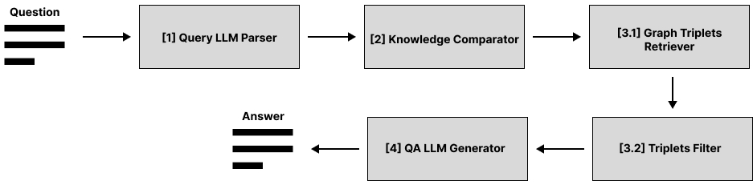

Высокоуровневая архитектура
===========================

QA-конвейер
-----------

Общий конвейер по извлечению релевантной информации из графа знаний для генерации ответов на вопросы представлен на Рисунке 1.

   Рисунок 1. Конвейер поиска информации в графе для генерации ответов на вопросы

Из Рисунка 1 видно, что конвейер разбит на четыре стадии, при этом третья стадия состоит из двух этапов. На вход конвейеру поступает пользовательский вопрос в строковом формате, который передаётся в модуль "Query LLM Parser". В данном модуле выполняется извлечение ключевых сущностей из вопроса. На второй стадии полученная информация передаётся в модуль "Knowledge Comparator" , где выполняется сопоставление (matching) сущностей из вопроса с объектами из графа знаний. На третей стадии  выполняется поиск и фильтрация триплетов из графа знаний, релевантных вопросу, в рамках первого и второго этапов соответственно. На первом этапе с помощью модуля “Graph Triplets Retriever” выполняется запуск одного из реализованных алгоритмов обхода графа: в качестве стартовых выступают те вершины, которые были сопоставлены сущностям из вопроса в рамках второй стадии конвейера. В результате будет извлечён список потенциально-релевантных триплетов. На втором этапе с помощью модуля “Triplets Filter” выполняется ранжирование триплетов по степени их семантической близости к вопросу. В результате работы третей стадии будет получен список из N (гиперпараметр) триплетов, ближайших (семантически) к данному вопросу. На последней четвёртой стадии с помощью модуля "QA LLM Generator" выполняется генерация ответа на вопрос, обусловленная извлечённой информацией. Полученный ответ в строковом формате возвращается как результат работы конвейера.

Данная архитектура конвейера мотивирована следующими соображениями:

* Для получения хорошего начального приближения к подграфу с требуемой информацией необходимо сопоставить ключевые объекты из вопроса с похожими объектами из имеющегося набора знаний.
* Информация, которая требуется для генерации правильного ответа содержится в том же подграфе, что и ключевые сущности из вопроса.
* Извлечённые из графа знаний триплеты слабо обусловлены исходным вопросом. При этом каждый триплет имеет свою степень важной информации, которая требуется для генерации правильного ответа. Также у больших языковых моделей есть ограничение по максимальной длине текстовой последовательности, которую можно подать на вход.

Memorize-конвейер
-----------------

Первым этапом запоминания информации является извлечение из текста триплетов с помощью ЛЛМ и специального промпта. Триплет состоит из субъекта, отношения и объекта. Например, из текста "Корабельщики в ответ: «Мы объехали весь свет; За морем житье не худо; В свете ж вот какое чудо" будут извлечены триплеты [корабельщики, объехали весь, свет], [житье, не худо за, море], [чудо, есть в, свет]. Далее субъекты и объекты триплетов становятся нодами графа знаний, а отношение между ними - простой связью в нем.

Далее по аналогичному сценарию происходит извлечение тезисов и их сущностей. Тезис, как и триплет, содержит некоторую атомарную информацию из текста, однако, в отличие от триплета, может объединять произвольное количество сущностей и всегда содержит законченную мысль, не зависящую от контекста. Например, из текста "За морем житье не худо; В свете ж вот какое чудо: Остров на море лежит, Град на острове стоит" будут извлечены тезисы "За морем житье не худо", "В свете чудо - остров на море лежит", "В свете чудо - град на острове стоит" со списками сущностей [море, житье], [свет, чудо, остров, море], [свет, чудо, град, остров] соответственно. Такая гиперсвязь также помещается в граф.

Наконец, весь исходный текст также помещается в граф как гиперсвязь между всеми сущностями, фигурирующими в извлеченных триплетах и тезисах. Такая гиперсвязь, по аналогии с когнитивными науками, называется эпизодической.

Поиск устаревшей информации в графе производится следующим образом. В начале множество сущнсотей, фигурирующих в только что извлеченных триплетах и тезисах сопоставялется с существующими вершинами графа для обнаржуения совпадений. Если таковые присутствуют, то они являются стартовым набором нод для поиска в ширину, который извлекает все связи и гепресвязи, начинающиеся или заканчивающиеся в этих нодах. Далее, с помощью специального промпта ЛЛМ пытается заменить найденные знания только что извлеченными. Если какие-то триплеты или тезисы смогли быть заменены, то они удаляются из графа.

Для добавления структурированной информации реализован алгоритм, ожидающий список знаний в определенном формате, и добавляющий их в существующий граф знаний.
