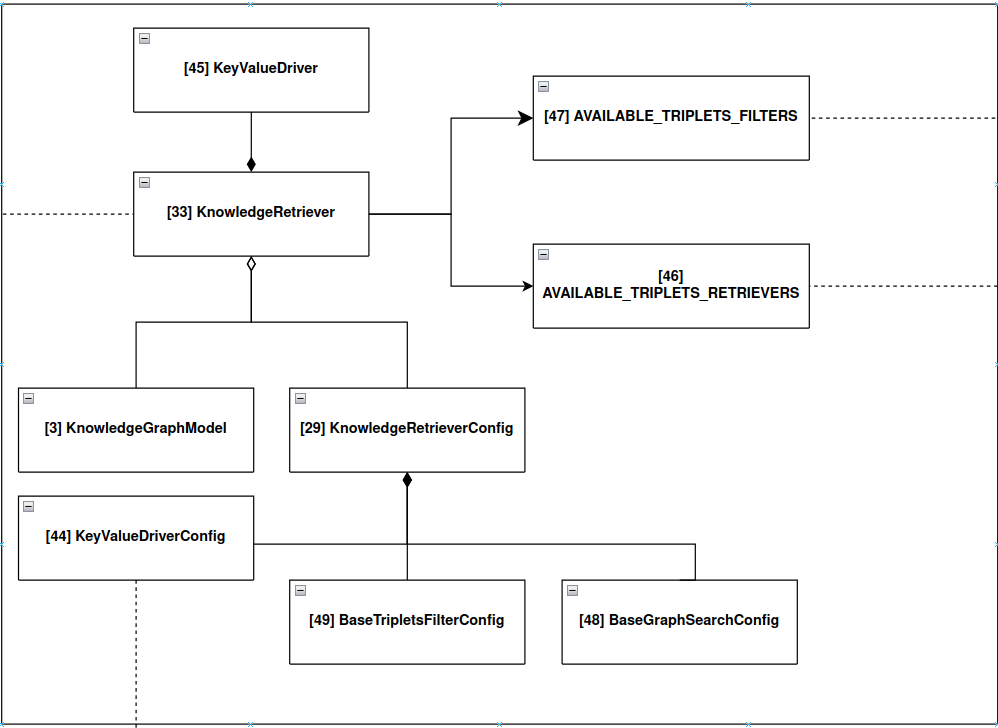

Knowledge Retriever
===================

.. toctree::
   :maxdepth: 1
   :caption: Contents:

   triplets_retriever
   triplets_filter

src.pipelines.qa.knowledge\_retriever package
---------------------------------------------

src.pipelines.qa.knowledge\_retriever.KnowledgeRetriever module
^^^^^^^^^^^^^^^^^^^^^^^^^^^^^^^^^^^^^^^^^^^^^^^^^^^^^^^^^^^^^^^

.. autoclass:: src.pipelines.qa.knowledge_retriever.KnowledgeRetriever.KnowledgeRetrieverConfig()
   :members:
   :undoc-members:
   :show-inheritance:

.. autoclass:: src.pipelines.qa.knowledge_retriever.KnowledgeRetriever.KnowledgeRetriever()
   :members:
   :undoc-members:
   :show-inheritance:

src.pipelines.qa.knowledge\_retriever.utils module
^^^^^^^^^^^^^^^^^^^^^^^^^^^^^^^^^^^^^^^^^^^^^^^^^^

.. automodule:: src.pipelines.qa.knowledge_retriever.utils
   :members:
   :undoc-members:
   :show-inheritance:
   :no-index:
